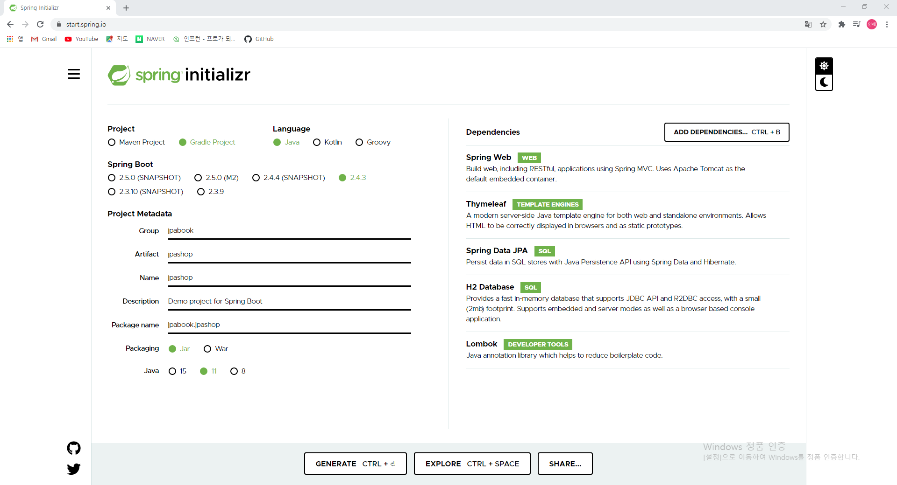
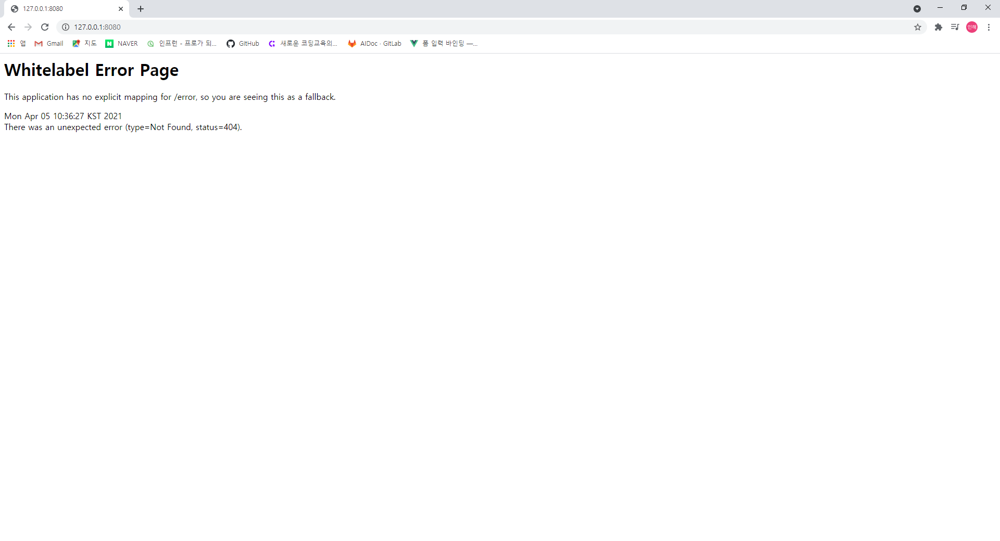
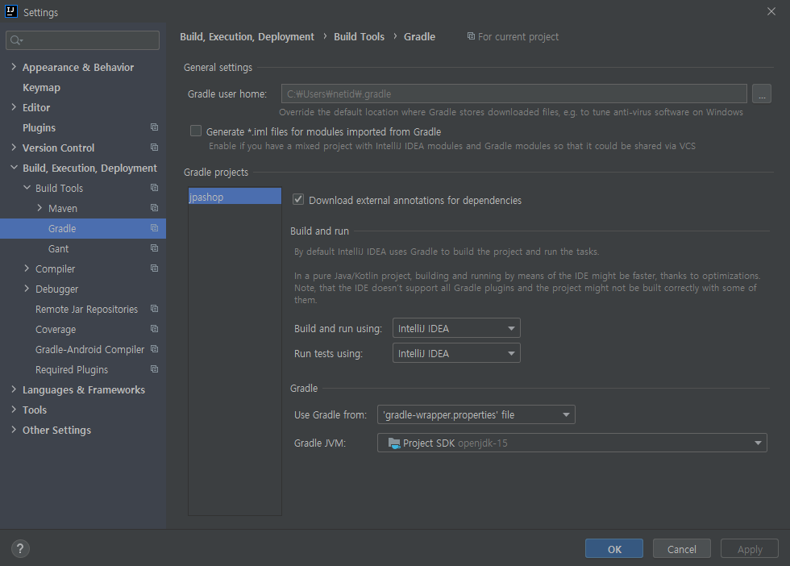
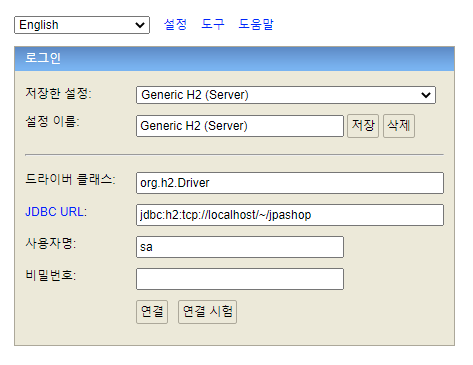
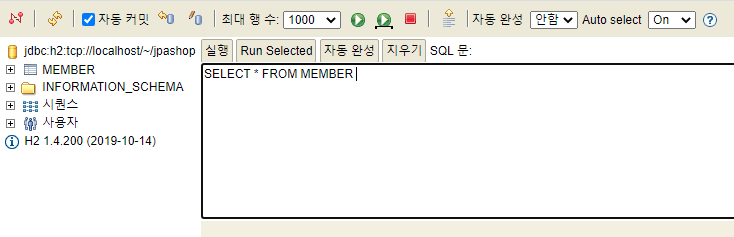
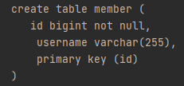
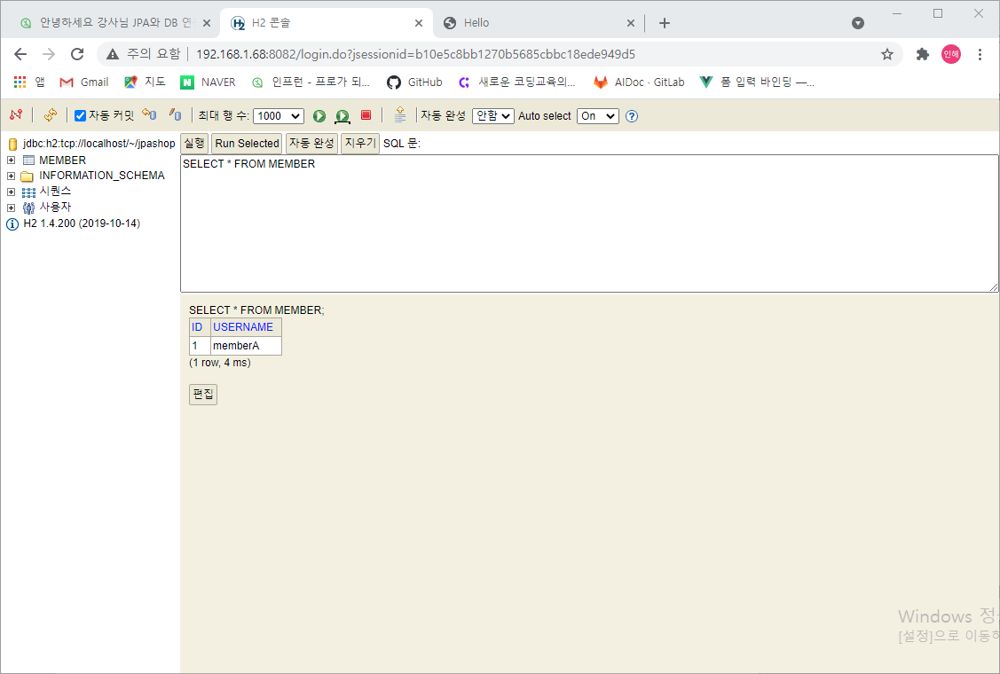

# 프로젝트 환경설정


## 프로젝트 생성 및 실행

1) 스프링 부트 스타터: <https://start.spring.io/>

2) Maven / Gradle 선택 (요즘 메이븐에서 그래들로 넘어가는 추세), Java언어, 안전한 버전 사용

3) dependencies

1. Spring Web
2. Thymleaf
3. Spring Data JPA
4. H2 Database (MySQL같은 데이터베이스는 설치가 까다로우나 이건 쉬움)
5. lombok (지루하게 반복되는 코드를 줄여줌 / 간단한 allocation 하나로 generation해주는 것)



4) Generate해서 알집파일 다운로드 후 IntelliJ에서 키기

5) jpashop > src > main > java > jpabook.jpashop > JpashopApplication 실행

6) 127.0.0.1:8080 에서 아래 화면이 뜨면 setting이 잘 된 것



7) File > setting > Plugins > lombok 업데이트 해야하면 하기 / Annotation Processors 검색해서 Enable annotation processing 체크해주기(lombok 실행)

8) 오른쪽 위에 Gradle > dependencies 눌러서 라이브러리들 확인 가능

9) 아래와 같이 `Build and run using`과 `Run tests using`을 IntelliJ IDEA로 바꾸어줄 것




-----


## 라이브러리 살펴보기

**gradle 의존관계 보기**

```
./gladlew dependencies --configuration compileClasspath
```


#### 스프링 부트 라이브러리 살펴보기

- spring-boot-starter-web
  - spring-boot-starter-tomcat: 톰캣(웹서버)
  - spring-webmvc: 스프링 웹 MVC
- spring-boot-starter-thymeleaf: 타임리프 템플릿 엔진(View)
- spring-boot-starter-data-jpa
  - spring-boot-starter-aop
  - spring-boot-starter-jdbc
    - HikariCP 커넥션 풀 (부트 2.0 기본)
  - hibernate + JPA: 하이버네이트 + JPA
  - spring-data-jpa: 스프링 데이터 JPA
- spring-boot-starter(공통): 스프링부트 + 스프링코어+로깅
  - spring-boot
    - spring-core
  - spring-boot-starter-logging
    - logback, slf3j


#### 테스트 라이브러리

- spring-boot-starter-test
  - junit: 테스트 프레임워크
  - mockito: 목 라이브러리
  - assertj: 테스트 코드를 좀 더 편하게 작성하게 도와주는 라이브러리
  - spring-test: 스프링 통합 테스트 지원

- 핵심 라이브러리
  - 스프링 MVC
  - 스프링 ORM
  - JPA, 하이버네이트
  - 스프링 데이터 JPA
- 기타 라이브러리 
  - H2 데이터베이스 클라이언트
  - 커넥션 풀: 부트 기본은 HikariCP
  - WEB(thymeleaf)
  - 로깅 SLF4J & LogBack
  - 테스트


※ 참고: 스프링 데이터 JPA는 스프링과 JPA를 먼저 이해하고 사용해야하는 기술이다.

※ 스프링부트가 대부분의 라이브러리들을 버전에 맞게 setting 해놓는데, 아닌 것들은 버전을 직접 적어주어야함

ex)

```
implementation 'com.github.gavlyukovskiy:p6spy-spring-boot-starter:1.5.6'
```


-----


## View 환경설정

- build.gradle 파일

  - 루트 프로젝트 디렉터리에 있으며 프로젝트의 모든 모듈에 적용되는 빌드 구성을 정의

  - 사용하는 플러그인이나 라이브러리 등을 포함

  - 파일의 변화를 바로바로 웹에 전달하기 위해서 

    ```
    	implementation 'org.springframework.boot:spring-boot-devtools'
    ```

    을 추가해주면 좋다. (캐쉬제거, reloading 등 개발에 도움되는 기능들이 많음)

    - html 파일에서 바뀐 내용을 바로 웹에서 보고 싶을 경우, 이 라이브러를 추가해준 후에 파일의 내용을 변경하고 이 파일만 Build > Recompile 을 해주면 됨

- main 폴더 / test 폴더

  - main 폴더에서 작업이 이루어지고, test폴더에서는 개발을 할 때 먼저 테스트를 해볼 수 있도록 구현함


-----


## H2 데이터베이스

개발이나 테스트 용도로 가볍고 편리한 DB, 웹 화면 제공




- https://www.h2database.com 다운로드 및 설치 

- 데이터베이스 파일 생성 방법 
  - jdbc:h2:~/jpashop (최소 한번)
  - ~/jpashop.mv.db 파일 생성 확인
  - 이후 부터는 jdbc:h2:tcp://localhost/~/jpashop 이렇게 접속


-----


## JPA와 DB 설정, 동작확인

- resources > application.properties 파일을 appplication.yml 으로 바꾸어줌
  - yml 파일이 더 간단하고 보기 편하며, 나중에 사용이 편리함
  - 띄어쓰기 두 칸으로 계층 분리

```yaml
spring:
  datasource:
    url: jdbc:h2:tcp://localhost/~/jpashop
    username: sa
    password:
    driver-class-name: org.h2.Driver

  jpa:
    hibernate:
    ddl-auto: create
    properties:
    hibernate:
    #show_sql: true
    format_sql: true

logging.level:
  org.hibernate.SQL: debug
  #org.hibernate.type: trace

```


- spring.jpa.hibernate.ddl-auto:
  - create 이 옵션은 애플리케이션 실행 시점에 테이블을 drop 하고, 다시 생성한다.


#### 동작 확인

##### 회원 엔티티 / src > main > java > jpabook.jpashop > Member

```java
package jpabook.jpashop;

import lombok.Getter;
import lombok.Setter;

import javax.persistence.Entity;
import javax.persistence.GeneratedValue;
import javax.persistence.Id;

@Entity
@Getter @Setter
public class Member {
    @Id @GeneratedValue
    private Long id;
    private String username;
}
```


##### 회원 리포지토리  / src > main > java > jpabook.jpashop > MemberRepository

```java
package jpabook.jpashop;

import org.springframework.stereotype.Repository;

import javax.persistence.EntityManager;
import javax.persistence.PersistenceContext;

@Repository
public class MemberRepository {
    @PersistenceContext
    private EntityManager em;

    public Long save(Member member) {
        em.persist(member);
        return member.getId();
    }

    public Member find(Long id) {
        return em.find(Member.class, id);
    }
}
```


##### 테스트 / src > test > java > jpabook.jpashop > MemberRepositoryTest

```java
package jpabook.jpashop;

import org.assertj.core.api.Assertions;
import org.junit.Test;
import org.junit.runner.RunWith;
import org.springframework.beans.factory.annotation.Autowired;
import org.springframework.boot.test.context.SpringBootTest;
import org.springframework.test.annotation.Rollback;
import org.springframework.test.context.junit4.SpringRunner;

import javax.transaction.Transactional;

import static org.junit.Assert.*;

@RunWith(SpringRunner.class)
@SpringBootTest
public class MemberRepositoryTest {
    @Autowired MemberRepository memberRepository;

    @Test
    @Transactional
    @Rollback(false)
    public void testMember() throws Exception {
        //given
        Member member = new Member();
        member.setUsername("memberA");
        //when
        Long savedId = memberRepository.save(member);
        Member findMember = memberRepository.find(savedId);

        //then
        Assertions.assertThat(findMember.getId()).isEqualTo(member.getId());
        Assertions.assertThat(findMember.getUsername()).isEqualTo(member.getUsername());
        Assertions.assertThat(findMember).isEqualTo(member);
        System.out.println("findMember == member: " + (findMember == member));
    }
}
```


※ 주의) @Test는 강의에서는 JUnit4를 사용하여 org.junit.Test를 사용해야한다. 이때, JUnit5를 사용하려면 그것에 맞게 사용하면 된다.


- Entity, Repository 동작 확인
- jar 빌드해서 동작 확인






테이블이 생성된 것을 확인할 수 있음

그러나 데이터베이스에 데이터가 추가되지않았음


Test 파일에 `@Transactional allocation`이 있으면 바로 롤백해버림(데이터가 들어가있으면 반복적인 테스트를 못하기 때문에)

따라서 아래에 `@Rollback(false)` 넣어주면 됨




**▲ 추가 완료**


오류: 테스트를 실행했는데 다음과 같이 테스트를 찾을 수 없는 오류가 발생하는 경우

```
No tests found for given includes: [jpabook.jpashop.MemberRepositoryTest] filter.includeTestsMatching)
```

> 해결: 
>
> 스프링 부트 2.1.x 버전을 사용하지 않고, 2.2.x 이상 버전을 사용하면 Junit5가 설치된다. 이때는 `build.gradle` 마지막에 다음 내용을 추가하면 테스트를 인식할 수 있다. Junit5 부터는` build.gradle` 에 다음 내용을 추가해야 테스트가 인식된다.


#### 쿼리파라미터로 로그 남기기

- 외부 라이브러리 사용

  - https://github.com/gavlyukovskiy/spring-boot-data-source-decorator

  - 위의 주소에서 README.md 의 P6Spy 설치

    - ```
      implementation("com.github.gavlyukovskiy:p6spy-spring-boot-starter:${version}")
      ```


> 쿼리 파라미터를 로그로 남기는 외부 라이브러리는 시스템 자원을 사용하므로 운영을 할 때 사용하려면 성능테스트가 꼭 필요하다
>
> 병목이 되어 성능을 저하시킬 수도  -> 이렇다면 개발단계에서만 쓰는 것을 권장

