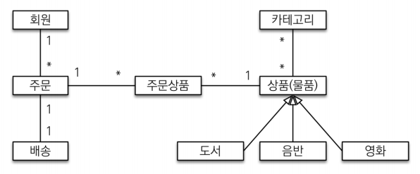
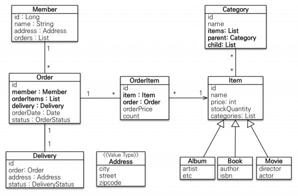
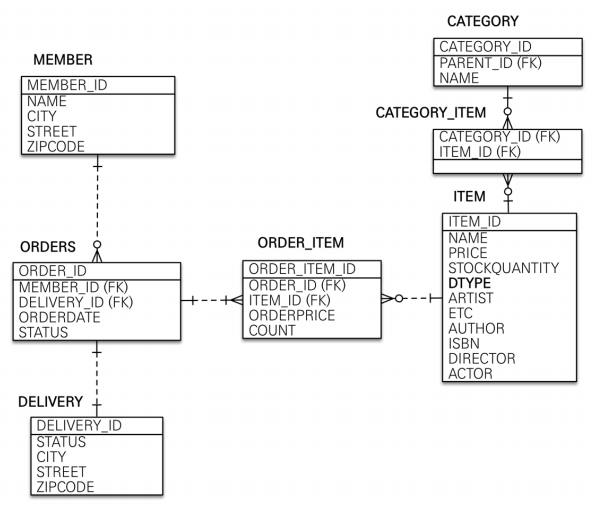

# 도메인 분석 설계

<br>

## 요구사항 분석

#### 기능 목록

- 회원 기능
  - 회원 등록
  - 회원 조회
- 상품 기능
  - 상품 등록
  - 상품 수정
  - 상품 조회
- 주문 기능
  - 상품 주문
  - 주문 내역 조회
  - 주문 취소
- 기타 요구사항
  - 상품은 재고 관리가 필요하다
  - 상품의 종류는 도서, 음반, 영화가 있다
  - 상품을 카테고리로 구분할 수 있다.

<br><br>

-----

<br>

## 도메인 모델과 테이블 설계

<br>



<br>

- 회원은 여러 주문할 수 있어서의 관계는 일대다의 관계

- 주문할 때 여러 상품을 주문할 수 있고,  상품도 주문상품에 여러 개가 담길 수 있기 때문에 일대다, 다대일의 관계로 풀어내어 중간에 ''주문상품''이라는 엔티티를 추가함
- 주문 하나 당 배송정보를 하나 입력하므로 일대일의 관계
- 상품은 도서/음반/영화로 나누어짐
  - 상속구조
- 여러 개의 상품이 하나의 카테고리에 들어갈 수도 있고, 하나의 상품이 여러 개의 카테고리에 들어갈 수도 있어서 다대다의 관계

<br>

### 회원 엔티티 분석 - 실제 설계상 엔티티

<br>



<br>

- **회원(Member)**: 이름과 임베디드 타입인 주소( `Address` ), 그리고 주문( `orders` )을 리스트로 가진다.

- **주문(Order)**: 한 번 주문시 여러 상품을 주문할 수 있으므로 주문과 주문상품( `OrderItem` )은 일대다 관계다. 주문은 상품을 주문한 회원과 배송 정보, 주문 날짜, 주문 상태( `status` )를 가지고 있다. 주문 상태는 열 거형을 사용했는데 주문( `ORDER` ), 취소( `CANCEL` )을 표현할 수 있다.

  > 회원을 통해서 주문을 생성하는 것이 아니라 주문을 할 때 회원이 필요하다라고 보는 것이 맞다. 이때 사람의 생각과 컴퓨터는 다른데, 회원과 주문은 동급으로 놓고 보아야한다.
  >
  > 사실 회원-주문간의 관계처럼 양방향의 관계는 매우 좋지않음 / 되도록 단방향으로 구현할 것
  >
  > (강의에서는 풍성한 예제를 위해서 다양한 관계들을 넣어놓은 것)

- **주문상품(OrderItem)**: 주문한 상품 정보와 주문 금액( `orderPrice` ), 주문 수량( `count` ) 정보를 가지고 있다. (보통 `OrderLine` , `LineItem` 으로 많이 표현한다.)

- **상품(Item)**: 이름, 가격, 재고수량( `stockQuantity` )을 가지고 있다. 상품을 주문하면 재고수량이 줄어든다. 상속관계로 상품의 종류인 도서, 음반, 영화가 있는데 각각은 사용하는 속성이 조금씩 다르다.

- **배송(Delivery)**: 주문시 하나의 배송 정보를 생성한다. 주문과 배송은 일대일 관계다.

- **카테고리(Category)**: 상품과 다대다 관계를 맺는다. `parent` , `child` 로 부모, 자식 카테고리를 연결한다.

  > 사실 다대다 관계는 사용하면 안됨 / 되도록이면 일대다, 다대일의 관계로 풀어주는 것이 좋음

- **주소(Address)**: 값 타입(임베디드 타입)이다. 회원과 배송(Delivery)에서 사용한다.

<br>

### 회원 테이블 분석

<br>



<br>

- **MEMBER**: 회원 엔티티의 Address 임베디드 타입 정보가 회원 테이블에 그대로 들어갔다. 이것은 DELIVERY 테이블도 마찬가지다.

- **ORDERS**: DB에 `order by` 예약어때문에 `ORDER`이 잘 인식되지 않는다. 따라서 `ORDERS`를 테이블명으로 자주 사용한다.

- **CATEGORY_ITEM**: `CARTEGORY`와 다대일의 관계, `ITEM`과 일대다의 관계를 가진다.

  객체는 다대다 관계를 만들 수 있지만, 관계형 데이터베이스에서는 일반적인 설계로는 불가능하다. 따라서 이 매핑 테이블을 두어 일대다, 다대일 관계로 풀어낼 수 있다.

- **ITEM**: 세 가지 상속관계 매핑 중에서 가장 간단한 싱글테이블 전략 앨범, 도서, 영화 타입을 통합해서 하나의 테이블로 만들었다. `DTYPE` 컬럼으로 타입을 구분한다.

> 데이터베이스 테이블명, 컬럼명에 대한 관례는 회사마다 다르다. 보통은 대문자 + _(언더스코어)나 소문자 + _(언더스코어) 방식 중에 하나를 지정해서 일관성 있게 사용한다. 강의에서 설명할 때는 객체와 차이를 나 타내기 위해 데이터베이스 테이블, 컬럼명은 대문자를 사용했지만, 실제 코드에서는 소문자 + _(언더스코 어) 스타일을 사용할 것이다.

<br>

### 연관관계 매핑 분석

- **회원과 주문**: 일대다 , 다대일의 양방향 관계다. 따라서 연관관계의 주인을 정해야 하는데, 외래 키가 있는 주 문을 연관관계의 주인으로 정하는 것이 좋다. 그러므로 `Order.member` 를 `ORDERS.MEMBER_ID` 외래 키와 매핑한다.

  > 엔티티에서는 회원에 orders 필드가, 주문에 member 필드가 둘다 존재한다. 그러나 이때, 만약 주문을 바꾸려면 JPA는 어디에 접근해서 고쳐야할까?
  >
  > <span style="color:purple">**테이블에서는 이 둘 중 하나를 Foriegn Key(FK/외래키)로 지정하여 하나만 생성하고, 변경도 이 FK로 하면 되고 FK를 가진 쪽이 연관관계의 주인이 된다.**</span>
  >
  > 여기에서는 ORDERS가 연관관계의 주인이 된다.

- **주문상품과 주문**: 다대일 양방향 관계다. 외래 키가 주문상품에 있으므로 주문상품이 연관관계의 주인이다. 그러므로 `OrderItem.order` 를 `ORDER_ITEM.ORDER_ID` 외래 키와 매핑한다.

- **주문상품과 상품**: 다대일 단방향 관계다. `OrderItem.item` 을 `ORDER_ITEM.ITEM_ID` 외래 키와 매핑한 다.

- **주문과 배송**: 일대일 양방향 관계다. `Order.delivery` 를 `ORDERS.DELIVERY_ID` 외래 키와 매핑한다.

- **카테고리와 상품**: `@ManyToMany` 를 사용해서 매핑한다.(실무에서 `@ManyToMany`는 사용하지 말자. 여기 서는 다대다 관계를 예제로 보여주기 위해 추가했을 뿐이다)

<br>

> <span style="color:green">**Foriengn Key(FK)**</span>
>
> 연관된 두 개의 테이블에 각각의 필드가 서로의 객체 안에 있는 경우, 어떤 것을 update해야  하지? (둘 중에 하나만 선택하도록 JPA 규약을 만들어놓음)
>
> 테이블을 생성할 때 FK를 정의
>
> FK가 정의된 테이블이 자식테이블 / 참조되는 테이블이 부모테이블
>
> 부모테이블은 미리 생성되어 있어야하며, 참조되는 컬럼에 존재하는 값만을 입력할 수 있다. 또한 FK로 인해 삭제가 불가능하다.
>
> 외부키, 참조키, 외부 식별자 등으로 불린다.
>
> >  <span style="color:green">※ 연관관계의 주인 지정하는 방법</span>
> >
> > FK 키가 있는 곳으로 매핑하면 됨 / FK와 가까운 쪽

<br>

> 참고: 외래 키가 있는 곳을 연관관계의 주인으로 정해라. 
>
> 연관관계의 주인은 단순히 외래 키를 누가 관리하냐의 문제이지 비즈니스상 우위에 있다고 주인으로 정하면 안된다. 예를 들어서 자동차와 바퀴가 있으면, 일대다 관계에서 항상 다쪽에 외래 키가 있으므로 외래 키가 있는 바퀴를 연관관계의 주인으로 정하면 된다. 물론 자동차를 연관관계의 주인으로 정하는 것이 불가능 한 것은 아니지만, 자동차를 연관관계의 주인으로 정하면 자동차가 관리하지 않는 바퀴 테이블의 외래 키 값이 업데이트 되므로 관리와 유지보수가 어렵고, 추가적으로 별도의 업데이트 쿼리가 발생하는 성능 문제도 있 다. 자세한 내용은 JPA 기본편을 참고하자.

<br><br>

-----

<br>

## 엔티티 클래스 개발

- 가급적 Getter는 열어두고, Setter는 꼭 필요한 경우에만 사용하는 것을 추천
  - 사실 Getter와 Setter 모두 제공하지 않고, 필요한 별도의 메서드를 제공하는 것이 가장 이상적이지만, 실무에서 엔티티의 데이터는 조회할 일이 많으므로 Getter는 열어두는 것이 편리하다.
  - 그러나 Setter를 호출하면 데이터가 변하기 때문에, 열어두면 추후에 엔티티가 왜 변경되는지 추적하기 힘들어지므로, 변경지점이 명확하도록 변경을 위한 비즈니스 메서드를 별도로 제공해야 한다.
- 실무에서는 `@ManyToMany` 를 사용하지 않는 것을 추천
  - `@ManyToMany`는 언뜻보면 편리한 것 같지만, 중간테이블(여기에서는 `CATEGORY_ITEM`)에 컬럼을 추가할 수 없고, 세밀하게 쿼리를 실행하기 어렵기 때문에 실무에서 사용하기에는 한계가 있다. 중간 엔티티(`CategroryItem`)를 만들고 `@ManyToOne`, `@OneToMany`로 매핑해서 사용하자.
  - 다대다 매핑 -> 일대다, 다대일 매핑으로 풀어낼 것
- 값 타입은 변경불가능하게 설계해야 함
  - `@Setter` 를 제거하고, 생성자에서 값을 모두 초기화해서 변경 불가능한 클래스를 만드는 것이 좋다
  - JPA 스펙상 엔티 티나 임베디드 타입(`@Embeddable` )은 자바 기본 생성자(`default constructor`)를 public 또는 protected 로 설정해야 한다 / protected 로 설정하는 것이 그나마 더 안전
  - JPA가 이런 제약을 두는 이유는 JPA 구현 라이브러리가 객체를 생성할 때 리플랙션 같은 기술을 사용할 수 있도록 지원해야 하기 때문이다.

<br>

#### ※ 알아둘 것들

1)

```java
@Inheritance(strategy = InheritanceType.SINGLETABLE)
```

**`InheritanceType.JOINED/SINGLE_TABLE/TABLE_PER_CLASS`**

- JOINED : 정규화된 스타일

- SINGLE_TABLE : 하나에 모두 들어가도록 하는 것

- TABLE_PER_CLASS: 클래스마다 하나씩 (지금으로 치면, Item에 Movie, Album, Book 총 세 개가 들어감)

<br>

2)

```java
@Enumerated(EnumType.ORDINAL)
private DeliveryStatus status; //READY, COMP -> 배송준비, 배송
```

Enum으로 선언해주었다면(예시에서는 DeliveryStatus) 이 태그를 꼭 넣어야한다.

**`EnumType.ORDINAL/STRING`**

- ORDINAL - default / 숫자로 들어감(1, 2, 3, 4, ... ) / 중간에 다른 변수가 생겼을때 숫자가 밀리게 되는 큰 단점이 있다.

- STRING - 중간에 (READY, COMP이외의) 다른 변수가 생겨도 괜찮다.

<br>

3)

```java
//Order.java
	@OneToOne
    @JoinColumn(name = "delivery_id")
    private Delivery delivery;

//Delivery.java
	@OneToOne(mappedBy = "delivery")
    private Order order;
```

Order와 Delivery에 각각 delivery, order필드가 있는데, 이때 Order에 FK를 넣고 연관관계의 주인으로 지정해주었다. 따라서, Foreign Key가 있는 Order에는 `@JoinColume(name = "delivery_id")` 을 / Delivery에는 `@OneToOne(mappedBy = "delivery")` 을 설정해주어야한다.

<br>

4)

```java
@OneToOne(mappeBy = "order", cascade = CascadeType.ALL)
```

- `cascade = CascadeType.ALL` = 모든 Cascade(종속)를 적용하는 것 / 

- 원래는 엔티티당 각각 호출해줘야했는데, 이렇게 하나로 통일할 수 있게 된다.

  `persist(orderItemA)`

  `persist(orderItemB)`

  `persist(orderItemC)`

  `persist(order)`

  ↓

  `persist(order)` 

<br>

5)

```java
//==연관관계 편입 메서드==//
public void setMember(Member member) {
    this.member = member;
    member.getOrders().add(this);
}

public static void main(String[] args) {
    Member member = new Member();
    Order order = new Order();
    
    member.getOrders().add(order);
    order.setMember(member);
}
```

양방향 setting할 때, 아래 코드처럼 모두 적어주려면 하나씩 깜빡할 수도 있고 실수하기 쉬우니 위의 코드처럼 대입을 시켜놓으면 좋다.

<br><br>

-----

<br>

## 엔티티 설계시 주의점

1. **엔티티에는 가급적 Setter를 사용하지 말자**

   - 변경 포인트가 너무 많아서 유지보수의 어려움
   - 나중에 리펙토링으로 Setter 제거할 것

   <br>

2. **모든 연관관계는 <span style="color:red">지연로딩</span>으로 설정하기**

   - 즉시로딩( `EAGER` )은 예측이 어렵고, 어떤 SQL이 실행될지 추적하기 어렵다. 특히 JPQL을 실행할 때 N+1 문제가 자주 발생한다. 
     - 최악의 경우에는 하나를 가져올 때 연관된 데이터들을 다 끌고오게 된다.
     - JPQL select o Forom order o;  ->  SQL select * from order 100 + 1(처음 order)
   - 실무에서 모든 연관관계는 <span style="color:red">지연로딩( `LAZY` )</span>>으로 설정해야 한다.
   - 연관된 엔티티를 함께 DB에서 조회해야 하면, fetch join 또는 엔티티 그래프 기능을 사용한다. @XToOne(OneToOne, ManyToOne) 관계는 기본이 즉시로딩이므로 직접 지연로딩으로 설정해야 한다.
     - 반대로 @XToMany(OneToMany, ManyToMany) 관계는 기본이 지연로딩이므로 괜찮다.

   <br>

3. **컬렉션은 필드에서 초기화하자**

   - `null`문제에서 안전하다.

   - 하이버네이트는 엔티티를 영속화할 때, 컬랙션을 감싸서 하이버네이트가 제공하는 내장 컬렉션으로 변경하낟. 만약 아래의 `getOrders()` 처럼 임의의 메서드에서 컬력션을 잘못 생성하면 하이버네이트 내부 메커니즘에 문제가 발생할 수 있다. 따라서 필드레벨에서 생성하는 것이 가장 안전하고, 코드도 간결하다.

     ```java
     Member member = new Member();
     System.out.println(member.getOrders().getClass());
     em.persist(team);
     System.out.println(member.getOrders().getClass());
     
     //출력 결과
     class java.util.ArrayList
     class org.hibernate.collection.internal.PersistentBag
     ```

<br>

4. **테이블, 컬럼명 생성 전략**

   - 스프링 부트에서 하이버네이트 기본 매핑 전략을 변경해서 실제 테이블 필드명은 다름

   - https://docs.spring.io/spring-boot/docs/2.1.3.RELEASE/reference/htmlsingle/#howtoconfigure-hibernate-naming-strategy

   -  http://docs.jboss.org/hibernate/orm/5.4/userguide/html_single/Hibernate_User_Guide.html#naming

     <br>

   - 하이버네이트 기존 구현: 엔티티의 필드명을 그대로 테이블의 컬럼명으로 사용

     `SpringPhysicalNamingStrategy`

     <br>

   - 스프링부트 신규 설정(엔티티(필드) → 테이블(컴럼))

     1. 카멜케이스 → 언더스코어(memberPoint → member_point)
     2. .(점) → _(언더스코어)
     3. 대문자 → 소문자

      <br>

   1) 논리명 생성

   ​	: 명시적으로 컬럼, 테이블명을 직접 적지 않으면 사용

   2) 물리명 적용

   ​	: 모든 논리명에 적용됨

<br><br>

-----

<br>

소스코드는 domain-analysis 브랜치에 업로드